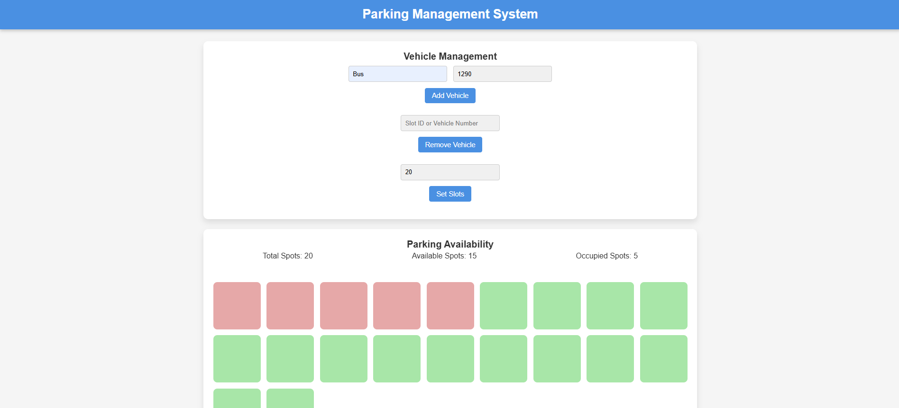

# Parking Management System

A fully functional and dynamic **Parking Management System** that allows users to manage parking slots, track vehicle occupancy, and automate payment processing. This system provides a seamless experience for both parking managers and vehicle owners with real-time updates on parking availability and intuitive mobile integration for users.

## Features

- **Real-Time Parking Availability**: Displays live parking spot availability and updates dynamically as users park or remove vehicles.
- **Vehicle Management**: Easily add and remove vehicles by type, number, or slot ID.
- **Dynamic Slot Allocation**: Automatically updates parking slot statuses to reflect available, occupied, or reserved states.
- **Custom Alerts**: Notifies users of errors or success through interactive custom alerts.
- **Search Functionality**: Quickly search for parked vehicles by their vehicle number.
- **Responsive Design**: Fully responsive design for seamless usage across devices, including desktops and mobile devices.

## Demo

Try out the system in your browser and see the functionality in action. The demo includes interactive features for adding/removing vehicles, managing slots, and more.

## Technologies Used

- **HTML5**: For structuring the web page content.
- **CSS3**: To style the system and create smooth animations and transitions.
- **JavaScript**: Provides interactivity and dynamic functionality.
- **Flexbox/Grid Layout**: Used for responsive design and content alignment.

## Installation

To set up the Parking Management System on your local machine, follow the instructions below:

### 1. Clone the repository

```bash
git clone https://github.com/yourusername/parking-management-system.git
```

### 2. Open the project folder

Navigate to the project folder:

```bash
cd parking-management-system
```

### 3. Open the `index.html` file

Open the `index.html` file in your preferred web browser. This will launch the system locally.

---

## Usage

### Vehicle Management

- **Add a Vehicle**: You can add a vehicle by entering its **type** (e.g., Car, Motorcycle) and **vehicle number**. Click "Add Vehicle" to park the vehicle in the first available slot.
  
- **Remove a Vehicle**: To remove a vehicle, you can either enter the **slot ID** or **vehicle number**. The system will find the vehicle in the corresponding slot and make it available again.

- **Set Total Slots**: You can configure the total number of parking slots using the "Set Slots" input. The system will update the parking grid accordingly, displaying the new number of spots.

### Parking Availability

- **View Parking Stats**: The dashboard displays live stats of the total spots, available spots, and occupied spots.
  
- **Parking Grid**: A grid layout represents the parking spots. Each slot can be:
  - **Available**: A spot ready for parking (green).
  - **Occupied**: A spot already taken (red).
  - **Reserved**: A spot reserved for future use (yellow).

### Custom Alerts

- Alerts will be shown in case of errors (e.g., invalid inputs, duplicate vehicle numbers) or successful actions (e.g., vehicle added or removed). These alerts can be dismissed with the "OK" button.

---

## Code Overview

### HTML Structure (`index.html`)

- **Header**: Contains the title of the application.
- **Vehicle Management Section**: Contains input fields for adding/removing vehicles and setting the total number of parking slots.
- **Parking Availability Dashboard**: Displays live parking stats and the parking grid.
- **Alert Modal**: Custom modal that pops up for showing alerts.

### CSS Styling (`styles.css`)

- **General Styling**: Uses `flexbox` and `grid` to create a responsive, easy-to-navigate layout.
- **Animations**: Smooth animations for input fields, buttons, and slot interactions (e.g., fade-ins and slide-ins).
- **Slot Styling**: Each parking spot is styled to show whether it's available, occupied, or reserved, with hover effects to enhance the user experience.

### JavaScript Functionality (`script.js`)

- **Dynamic Slot Management**: Updates parking spot statuses when vehicles are added or removed.
- **Add/Remove Vehicle Logic**: Handles vehicle addition and removal, updating parking stats and slot statuses.
- **Search Function**: Highlights parking slots that contain a specific vehicle number.
- **Custom Alerts**: Triggers custom alerts for errors or successful actions.

---

## Custom Alerts

The system uses a custom alert modal to display messages to the user. It appears for a variety of reasons, such as:

- **Error Handling**: When the user inputs invalid data (e.g., empty vehicle fields or non-existent vehicle numbers).
- **Success Confirmation**: When a vehicle is successfully added or removed from a parking spot.

The modal appears on top of the existing content with a blurred background and a sliding animation for a smoother experience.

---

## Contributing

Contributions are welcome! If you'd like to improve the project, feel free to fork this repository and submit a pull request.

### How to Contribute

1. Fork this repository.
2. Clone your fork to your local machine.
3. Create a new branch (`git checkout -b feature-name`).
4. Make your changes.
5. Push your changes (`git push origin feature-name`).
6. Open a pull request to the main repository.

---

## License

This project is licensed under the MIT License - see the [LICENSE](LICENSE) file for details.

---

## Screenshots

### Parking Dashboard


---

## Contact

For any questions, issues, or suggestions, feel free to reach out to me at [sokandesujal@gmail.com].

---

## Acknowledgments

- **Font Awesome**: Used for icons.
- **Google Fonts**: For better typography.

